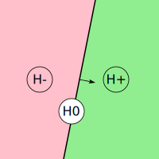
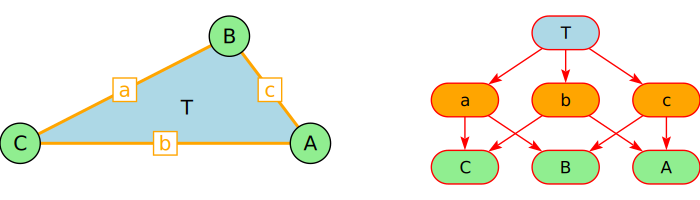
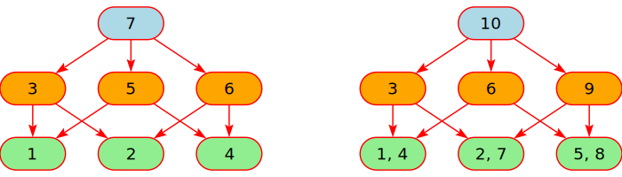
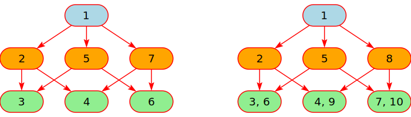

# HSI Halfspace Intersection

Calculate and draw convex polytopes from half-space equations

# Basics

## Half-spaces

In the euclidian space Rn a half-space is an (n-1) dimensonal hyperplane.
In R3 a half-space is an 2-dimensional plane, in R2 a half-space is
a straight line.

A half-space may be described with a linear expression called *half-space expression* of the form

a1x1 + a2x2 + ... + anxn + d

with fixed coefficients a1,a2, ..., an, and d.  A half-space
partitions the euclidian space into 3 distinct and convex areas:

* H- or H-: All (x1,x2, ..., xn) where the half-space expression evaluates to a negative value.
* H0 or H0: All (x1,x2, ..., xn) where the half-space expression evaluates to 0.
* H+ or H+: All (x1,x2, ..., xn) where the half-space expression evaluates to a positive value.

## Convex Polytopes

A convex polytope is the intersection of finitely many halfspaces in Rn.
In the sequel all polytopes are always convex.

The software in this repository calculates all faces of the polytope from the halfspaces.
For the 3-dimensional space this software creates simple drawings.

## Data Structure

All vertices, edges, sides and  hyperplanes are called *face*s. Set inclusion of the point sets of the faces defines a
half-order relation on the faces. Half-orders can be represented with *Hasse diagrams* which are
a special from of *directed acyclic graphs*. In Haskell we use *Map*s to implement directed acyclic graphs.

The next 2 images show all faces of a normal triangle as a geometric object and as a Hasse diagram:

## Algorithms on Hasse Diagrams

Similar to trees, algorithms can traverse the nodes (aka faces) of a Hasse diagram in preorder or
in postorder method. Different to trees, the traversal method can visit a node only once (*Single visit*) or multiple times (*Multiple visits*).

To specify an algorithm on a Hasse diagram we have to specify to following:

* Traversal method (preorder or postorder)
* Visting frequency (Single or Multiple)
* The processing done on each node / face.

The numbers in the nodes in the following images, represent the visiting sequence.

### Postorder Visiting Sequence (or bottom up)

### Preorder Visiting Sequence (or top down)

# HSI Algorithm

## Calculate Relative Position for each Face

## Intersect with H-

## Intersect with H0

# Higher Dimensions

# Input Program

# Terminology

Terminology is from [2]. We mainly use:

* 0-dim-faces are called `vertices`,
* 1-dim-faces are called `edges`,
* (dim(P) − 1)-faces are called `facets`.
* The dim(P) face is called `polytope`.

### References

[1] [Nef-W. (1978). Beiträge zur Theorie der Polyeder. Bern: Herbert Lang](https://books.google.ch/books/about/Beitr%C3%A4ge_zur_Theorie_der_Polyeder.html?id=3Lm0AAAAIAAJ&redir_esc=y)

[2] [Welz-E, Gärtner-B. (2020). Theory of Combinatorial Algorithms, Chapter 9 ](https://ti.inf.ethz.ch/ew/courses/Geo20/lecture/gca20-9.pdf)