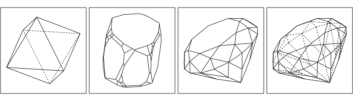
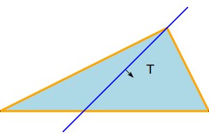
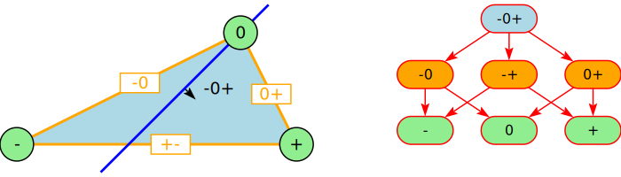
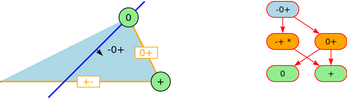
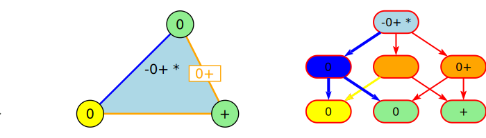

# HSI Halfspace Intersection: Calculate and draw convex polytopes from half-space equations

## Examples

# Basics

## Hyperplanes and Halfspaces

In the euclidian space Rn a hyperplane is a flat (n-1) dimensionl space.
In R3 a hyperplane is a normal 2-dimensional plane, in R2 a hyperplane is
just a straight line.

Algebraically a hyperplane can be described with a linear expression of the form

a1x1 + a2x2 + ... + anxn + d

with fixed coefficients a1,a2, ..., an, and d.  A hyperplane
partitions the euclidian space into 3 distinct and convex areas:

* H- or H-: All points (x1,x2, ..., xn) where the linear expression evaluates to a negative value. This is called the *negative open half-space*.
* H0 or H0: All points (x1,x2, ..., xn) where the linear expression evaluates to 0.
* H+ or H+: All points (x1,x2, ..., xn) where the linear expression evaluates to a positive value. This is called the *positive open half-space*.

The union of the point sets

* H- and H0 is called the *negative closed half-space*.
* H+ and H0 is called the *positive closed half-space*. In this project
a *half-space* is always a positive closed half-space.

## Convex Polytopes

A convex polytope is the intersection of finitely many half-spaces in Rn.
In the sequel a polytope means always a convex polytope.

From a set of half-spaces the software in this repository calculates all faces of the polytope.
In R3 this software also creates simple drawings.

## Data Structure

All vertices, edges, sides and  hyperplanes are called *face*s. Set inclusion of the point sets of the faces defines a
half-order relation on the faces. A half-orders can be represented with a *Hasse diagram* or a *face lattice diagram*. This is
a special form of a *directed acyclic graph*. In Haskell we can use *Map*s to implement directed acyclic graphs.

The next 2 images show all faces of a normal triangle as a geometric object and as a face diagram:

## Algorithms on Hasse Diagrams

Similar to trees, algorithms can traverse the nodes (aka faces) of a Hasse diagram in preorder or
in postorder method. Different to trees, the traversal method can visit a node multiple times (*Multiple visits*) or only once (*Single visit*).

To specify an algorithm on a Hasse diagram we have to specify the following:

* Traversal method (preorder or postorder)
* Visting frequency (Single or Multiple)
* The processing for each node / face.

The numbers in the nodes in the following images, represent the visiting sequence.

### Postorder Visiting Sequence (or bottom up)

### Preorder Visiting Sequence (or top down)

# HSI Algorithm

The algorithm to calculate a polytope from a set of halfspaces starts with a
huge cube and applies the HSI algorithm for each halfspace in the set.

To visualize the algorihm, we use a simple triangle. The red line is the half-space, the little
arrow points towards H+.

The following sctions contain a short description of the algorithm.

## 1. Calculate the Relative Position for each Face

The relative position to a halfspace for a vertex is either:

* **"0"** : if the vertex is part of H0
* **"+"** : if the vertex is part of H+
* **"-"** : if the vertex is part of H-

The relative position of a non-vertex face is the *OR*-combination of all vertices of this face.
eg For an edge with vertices on both sides of H0 the relative position is **"-+"**.

This is implemented by a postorder walk with single visits to the faces/nodes. For each face, the
following diagram shows the calculated relative position:

## 2. Intersection with H-

The intersection with H- is easy:

Algorithm: Postorder, Single visit.

Node processing: Remove every node with relative position "-" or "-0". Put keys

## 3. Intersection with H0

# Higher Dimensions

# Input Program

# Terminology

Terminology is from [2]. We mainly use:

* 0-dim-faces are called `vertices`,
* 1-dim-faces are called `edges`,
* (dim(P) − 1)-faces are called `facets`.
* The dim(P) face is called `polytope`.

### References

[1] [Nef-W. (1978). Beiträge zur Theorie der Polyeder. Bern: Herbert Lang](https://books.google.ch/books/about/Beitr%C3%A4ge_zur_Theorie_der_Polyeder.html?id=3Lm0AAAAIAAJ&redir_esc=y)

[2] [Welz-E, Gärtner-B. (2020). Theory of Combinatorial Algorithms, Chapter 9 ](https://ti.inf.ethz.ch/ew/courses/Geo20/lecture/gca20-9.pdf)

[3] [Article on Convex Polytopes on Wikipedia](https://en.wikipedia.org/wiki/Convex_polytope)